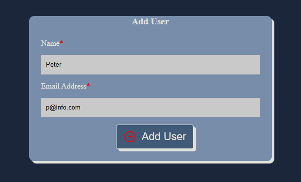
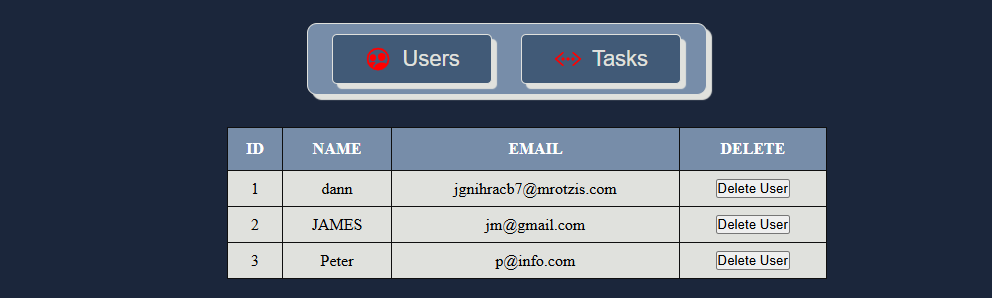
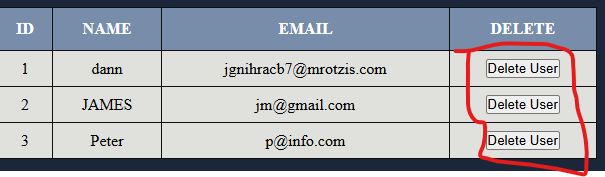
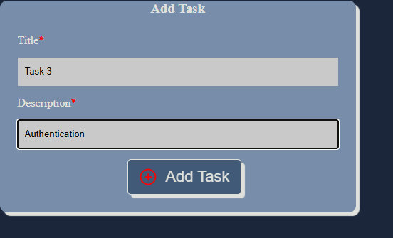
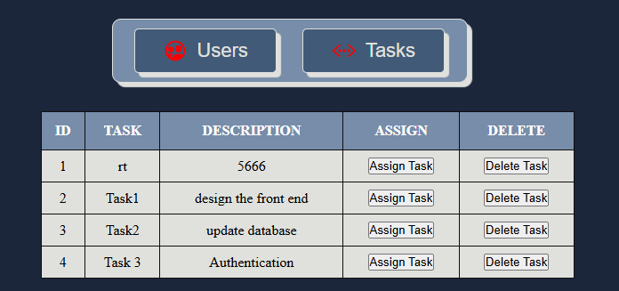

# Task Manager Application
A simple Task Manager application built with HTML, CSS, and TypeScript using Object-Oriented Programming (OOP) principles.

# Features
Perform CRUD operations on Users
Perform CRUD operations on Tasks
Assign tasks to users
# Creating a user
One will fill the user details in the form below

## Users display
after creating a user they diplay on the section shown below

## to delete a user you click the button delete user

# Crate Task

## Tasks Dipslay as shown below

## one can view the tasks and the users by clicking in the buttons users and tasks
